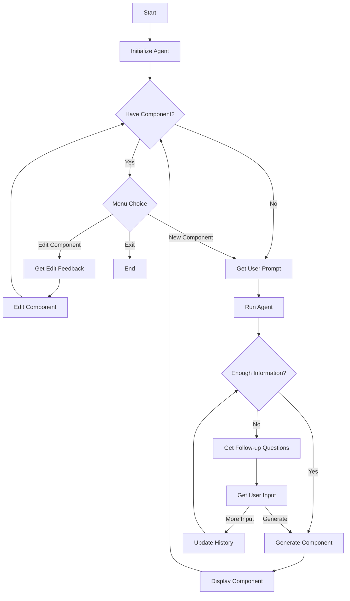

# UI-Alchemy

A WIP of a tool for generating Material UI React components using Azure AI Services.

### Overview

UI-Alchemy is a Python application that leverages Azure AI Projects to generate customized React components using Material UI. It creates an interactive (CLI based, for now :) ) dialog with the user to gather requirements and then produces fully functional UI components.

### Structure:

- [agents](./agents/): Contains the UI generation agent code and instructions
- [config](./config/) Configuration for Azure AI services
- [utils](./config/): Utility functions for file handling and logging

### Conversation Flow:

