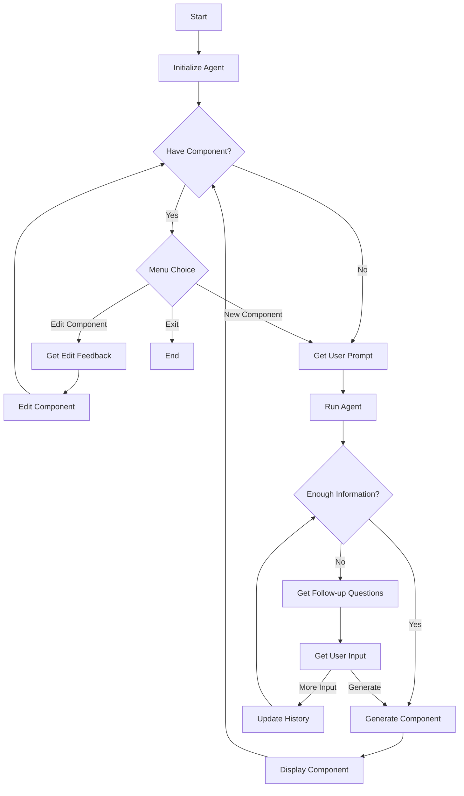
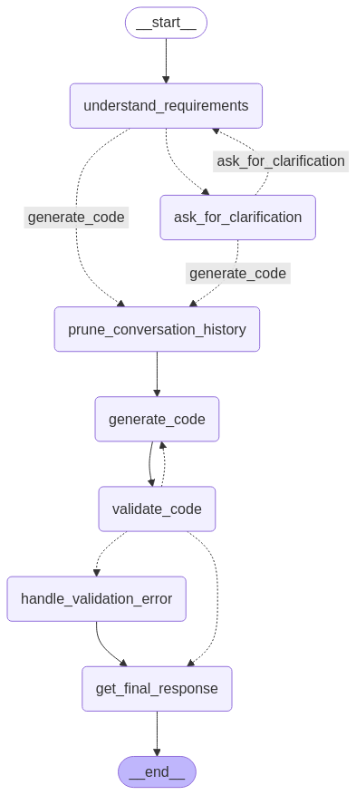

# UI-Alchemy

### Overview

UI-Alchemy is a Python-based application designed to generate customizable React components using Material UI. It interacts with users through a CLI to collect UI requirements and outputs fully functional, production-ready components.

### Current Focus

This project is in an experimental phase. I'm currently exploring:

- Azure AI Agent Service for orchestrating component generation workflows.

- LangGraph as an alternative approach to managing multi-step AI agent logic.

### Structure:

- [agents](./agents/): Contains the UI generation agent code and instructions
- [config](./config/) Configuration for Azure AI services
- [utils](./config/): Utility functions for file handling and logging

### Conversation Flow:

### Langgraph Graph (so far):

