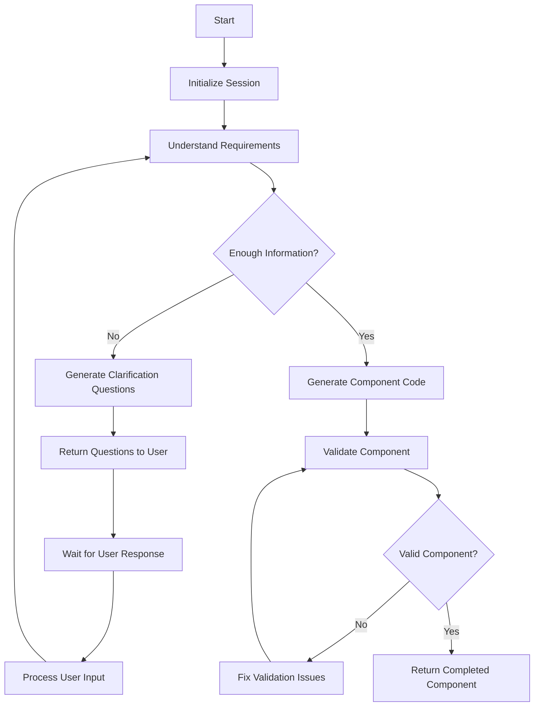

# UI-Alchemy

## Overview

WIP: UI-Alchemy is a Python-based API tool designed to generate customizable React components using Material UI.

## Architecture

This project uses LangGraph to orchestrate component generation and FastAPI to expose this as an API.

**Features so far**

- Conversational component generation
- Follow-up questions for clarification
- Validation of generated code
- Session-based API for persistent component generation

## Project Structure

- `/app`: Main application code
  - `/agent`: Contains the LangGraph workflow and state management
    - `ui_alchemy.py`: Core LangGraph workflow
    - `state.py`: State definitions and management
    - `tools.py`: Tool implementations for component generation
    - `config.py`: Configuration settings
  - `/utils`: Utility functions for file handling and logging
- `/main.py`: Application entry point

## API Endpoints

| Endpoint                                         | Method | Description                                  |
| ------------------------------------------------ | ------ | -------------------------------------------- |
| `/ui-alchemy/api/sessions`                       | POST   | Create a new component generation session    |
| `/ui-alchemy/api/sessions/{session_id}/messages` | POST   | Continue an existing session with user input |

## Component Generation Flow

